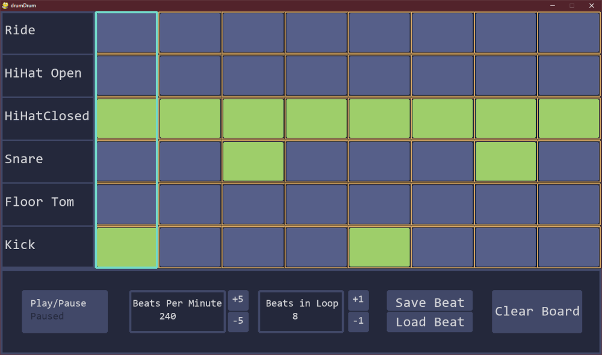
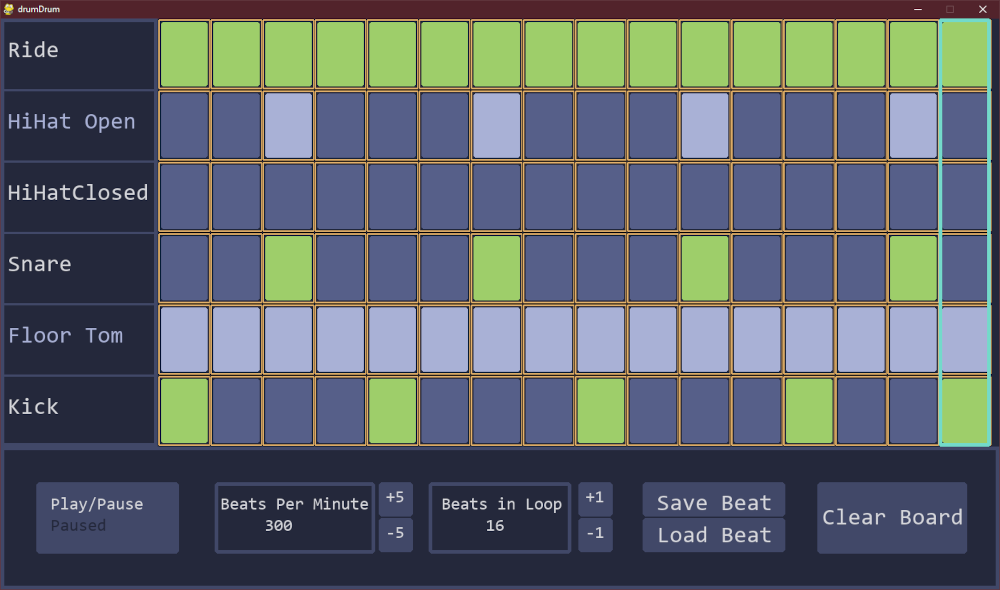
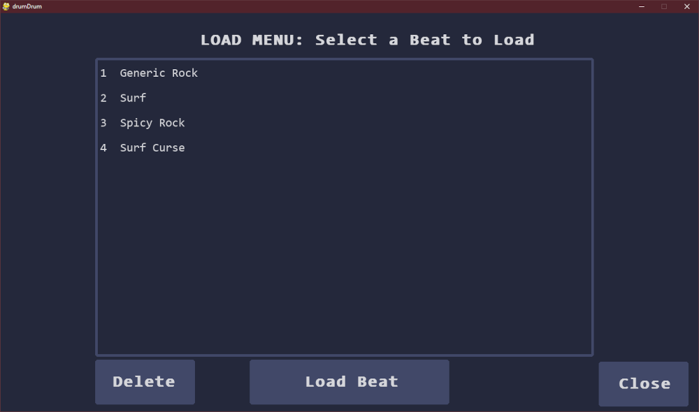
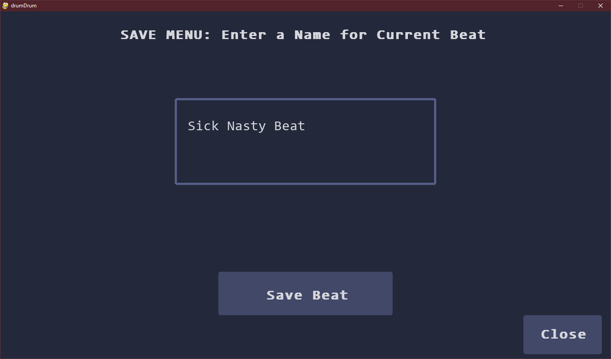

# drumDrum
a Drum Sequencer built with **Python** using the **Pygame** library.

# Installation
**Download the zip file.**

or 

**Clone the repo.**

then

**Run the `drumDrum.exe` file.**

## Screenshots

Add beats to the grid!

or mute entire rows!

Comes with pre-saved beats:

or Save your own beats:

## Usage
Click the buttons:

- Grid Buttons - turn sound on/off
- Instrument Button - mute entire row
- Play/Pause - play/pause loop
- Beats Per Minute Buttons - add/subtract BPM
- Beats in Loop Buttons - add/subtract beats from loop
- Save Beat Button - save current layout
- Load Beat Button - load a saved layout
- Clear Board Button - reset grid to empty

---
Adapted from: [this youtube project](https://youtu.be/F3J3PZj0zi0)
